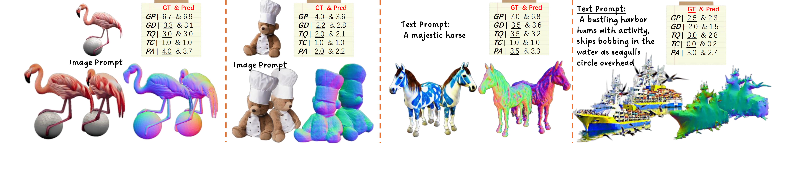
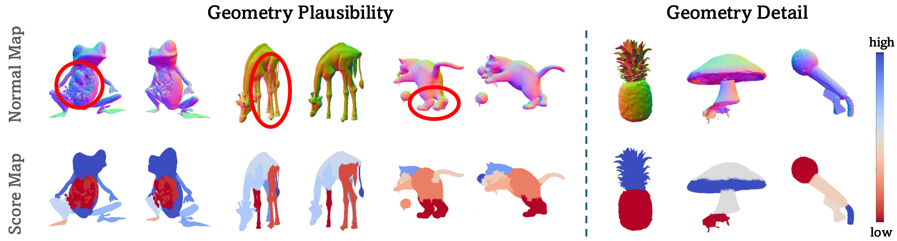

<div align="center">
  <!-- <h1> 🎉 NeurIPS 2025 Dataset and Benchmark Track</h1> -->
    <h1>Hi3DEval: Advancing 3D Generation Evaluation with Hierarchical Validity</h1>
  <p align="center">
    <p align="center">
      <a href="https://huggingface.co/ZhangYuhan">Yuhan Zhang*</a>
      ·
      <a href="https://zhuolong3.github.io/">Long Zhuo*</a>
      ·
      <a href="https://github.com/ChooseSun">Ziyang Chu*</a>
      ·
      <a href="https://wutong16.github.io/">Tong Wu†</a>
      ·
      <a href="https://lizb6626.github.io/">Zhibing Li</a>
      ·
      <a href="https://scholar.google.com/citations?user=lSDISOcAAAAJ&hl=zh-CN">Liang Pan†</a>
      ·
      <a href="http://dahua.site/">Dahua Lin</a>
      ·
      <a href="https://liuziwei7.github.io/">Ziwei Liu†</a>
      <br/>
      *Equal contribution  †Corresponding authors
      <br/>
    <!-- </p>
    <p> -->
        <a href="https://zyh482.github.io/Hi3DEval/">[Project page]</a>
        <a href="https://arxiv.org/abs/2508.05609">[ArXiv]</a>
        <a href="https://huggingface.co/spaces/3DTopia/3DGen-Leaderboard">[Leaderboard]</a>
        <a href="https://huggingface.co/datasets/3DTopia/Hi3DBench">[Dataset]</a>
    </p>
</div>


<p align="center">
<b>Overview of Hi3DEval</b>, a unified framework for 3D generation evaluation with three key components: 1) Hierarchical evaluation protocols that jointly assess object-level and partlevel quality, with extended material evaluation via reflectance cues. 2) A large-scale benchmark featuring a diverse set of 3D generative models and extensive human-aligned annotations generated via a multi-agent, multi-modal LLMs pipeline. 3) A hybrid automated scoring system that integrates video-based and naive 3D-based representations to enhance evaluators’ perceptions of 3D structure.
</p>

## Quick Start

- Our system support object-level evaluation, which is used for leaderboard. The evaluation protocol is consisted with five dimensions, `Geomotry Plausibility`, `Geometry Details`, `Texture Quality`, `Geometry-Texture Coherence` and `3D-Prompt Alignment`. The detailed setup and usage can be found in `obj_scoring/readme.md`.


- Since existing benchmark solely support aesthetic-level texture judgments, which is coarse, we propose protocols tailered to explicitly assess core physical properties, such as albedo, saturation, and metallicness. The detailed setup and usage can be found in `material_scoring/README.md`.


<!-- - Part-level: coming soon -->


## 📌 Citation

If our work is useful for your research, please consider citing our paper:

```bibtex
@article{zhang2025hi3deval,
  title={Hi3DEval: Advancing 3D Generation Evaluation with Hierarchical Validity},
  author={Zhang, Yuhan and Zhuo, Long and Chu, Ziyang and Wu, Tong and Li, Zhibing and Pan, Liang and Lin, Dahua and Liu, Ziwei},
  journal={arXiv preprint arXiv:2508.05609},
  year={2025}
}
```

